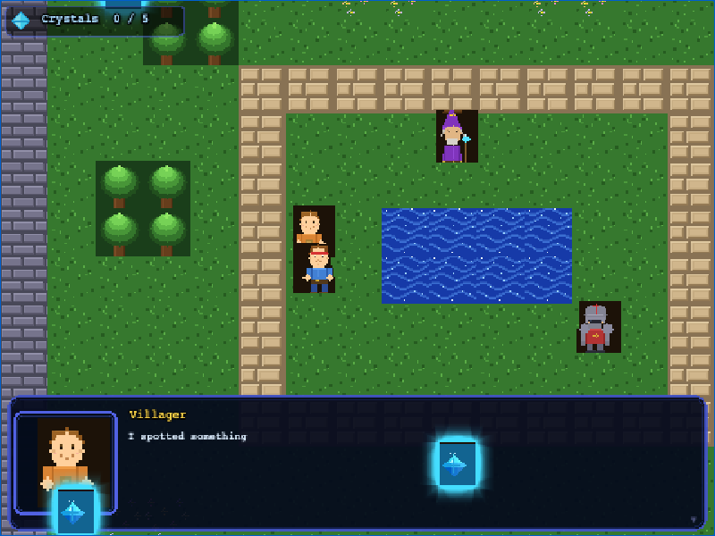
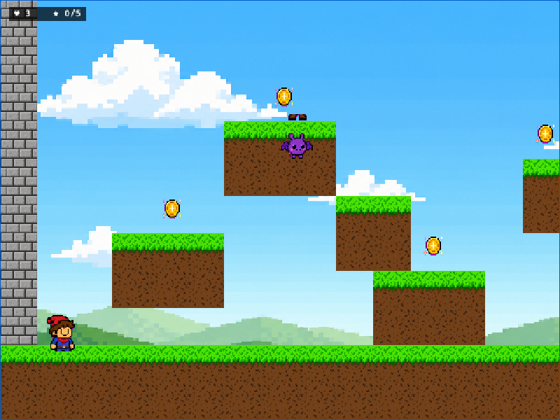
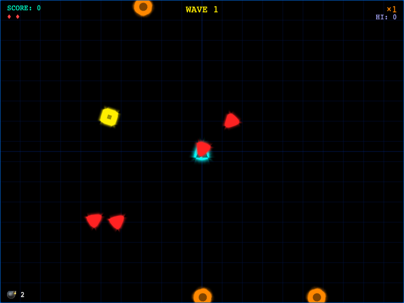
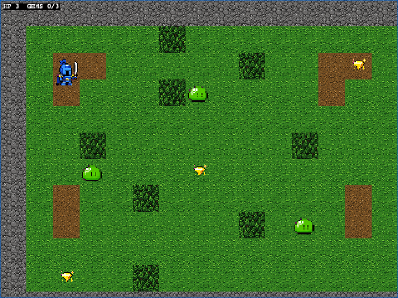
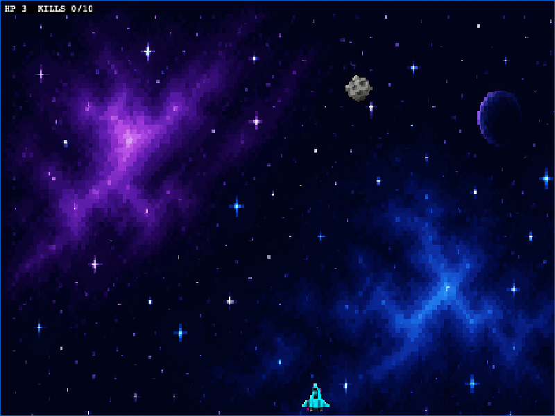

# game-exa

An AI agent skill pack — give any coding agent a one-line prompt and get a complete, gap-checked, playable **Phaser 3** game back. Zero boilerplate, zero hallucinated physics, gap-checker validates every level before calling it done.

> CLI binary: `gamewright`. Legacy alias `gameforge` also works.

## Example games

All screenshots taken live from headless Chromium via the gap-checker dynamic layer:

| Game | Genre | Screenshot |
|------|-------|-----------|
| **Crystal Village** — RPG hero explores a magical village, chats with NPCs (portrait dialogue), collects 5 glowing crystals | RPG Overworld |  |
| **Pixel Pete** — Jumpy hero collecting coins through floating platforms | Platformer |  |
| **Void Breaker** — Geometry Wars-style arena shooter; survive 10 neon waves | Arena shooter |  |
| **Slime Slayer** — Pixel knight collecting gems while dodging slimes | Top-down adventure |  |
| **Star Defender** — Fend off falling asteroids from your tiny ship | Shoot-em-up |  |

## How it works

```
description ─▶ game-designer ─▶ world-architect ─▶ sprite-artist ┐
                                                  tile-artist    ├─▶ codesmith ─▶ playtester ─▶ refiner ─▶ playtester
                                                  bg-artist      ┘                                ▲
                                                                                                   │ (max 3 retries)
                                                                  ┌──────────────────────────────┘
                                                  gap-checker ───▶ level-fixer / refiner (up to 3 fix iterations)
```

- **LLM stages** (`game-designer`, `world-architect`, `codesmith`, `refiner`) are plain SKILL.md instruction docs — your coding agent does the reasoning.
- **Asset stages** (`sprite-artist`, `tile-artist`, `bg-artist`) drive **GPT Image 2** for real pixel-art, with deterministic procedural fallbacks.
- **Deterministic stages** (`playtester`, `gap-checker`) are Node scripts — no LLM, no flakiness.
- **State** lives in `game-state.json`; every stage reads/writes it.

## Install

```bash
git clone https://github.com/Ar9av/game-exa.git ~/game-exa
cd ~/game-exa
npm install

# Symlink skills into your host's skill directory (Claude Code, Cursor, etc.)
mkdir -p ~/.claude/skills
ln -sf ~/game-exa/skills/* ~/.claude/skills/

# (Optional) Install Playwright's Chromium if you don't have system Chrome
npx playwright install chromium
```

## Usage

### Path A — host agent driven (the skill-pack way)

In your coding agent (Claude Code, Cursor, etc.), with the skills symlinked:

> *"Make me a game where a robot navigates a sewer collecting batteries."*

The agent reads `gamewright`'s SKILL.md, follows the pipeline, invokes the sub-skills, runs the deterministic scripts (`init_project.mjs`, `generate_sheets.mjs`, `paint_tiles.mjs`, `run_qa.mjs`, …), and reports success.

### Path B — embedded CLI (no host agent required)

```bash
export ANTHROPIC_API_KEY=sk-ant-...
export FAL_KEY=...               # for GPT Image 2 sprites

gamewright init my-game
cd my-game
gamewright generate "A pixel knight collects gems while dodging slimes"

# Skip image-gen for fast iteration
gamewright generate "..." --placeholder-sprites

gamewright dev                    # vite dev server on :5173
gamewright qa                     # run QA harness
gamewright qa --update-baselines  # refresh after intentional changes
gamewright refine                 # feed last QA failures to refiner
```

Global flags: `--json`, `--cwd`, `-y/--yes`, `-v/--verbose`. Exit codes: `0` ok, `2` usage, `3` config, `4` network, `5` QA failed, `130` SIGINT.

## Gap Checker — playability validation

`playtester` checks "does it boot and respond to input." `gap-checker` checks "is the game *actually playable*" — three layers, every generation:

```
static_check.mjs  →  dynamic_check.mjs  →  (VLM visual review)  →  level-fixer / refiner
```

**Static** (`skills/gap-checker/scripts/static_check.mjs`): pure JS, no browser.
- BFS reachability — every pickup/goal connected to player spawn
- Border integrity — outer ring must be impassable
- Jump-arc gaps — platformer gaps wider than 4 tiles flagged
- Standable spawns — players/enemies need ground beneath them

**Dynamic** (`skills/gap-checker/scripts/dynamic_check.mjs`): 30-second Playwright fuzzer.
- Detects stuck states, spawn-traps, out-of-bounds falls, progress stalls
- Captures screenshots at t=0, t=10s, t=20s, t=30s

**Gap-check results across all examples:**

| Game | Static | Dynamic |
|------|--------|---------|
| crystal-village | ✅ 0 errors | ✅ boots, player moves, crystals glow |
| pixel-pete | ✅ 0 errors | ✅ boots, player moves |
| void-breaker | ✅ 0 errors | ✅ boots, enemies spawn |
| slime-slayer | ✅ 0 errors | ✅ fuzzer collected gems |
| star-defender | ✅ 0 errors | ✅ boots, ship moves |

**Fixes applied automatically by the pipeline on pixel-pete:**
- Added impassable STONE walls on both side borders (player could walk off world edge)
- Inserted a stepping-stone platform to bridge an unjumpable 8-tile sky gap

```bash
# Static only (fast, no browser)
node skills/gap-checker/scripts/static_check.mjs examples/my-game

# Full dynamic + screenshots
node skills/gap-checker/scripts/dynamic_check.mjs examples/my-game --port 5199 --seconds 30
```

## Skills

| Skill | Role | Image gen? | Scripts |
|---|---|---|---|
| `gamewright` | Orchestrator: drives pipeline, manages state | — | `init_project.mjs`, `validate_state.mjs` |
| `game-designer` | Prompt → GDD JSON | — | `validate_gdd.mjs` |
| `world-architect` | GDD → level layouts | — | `validate_levels.mjs` |
| `sprite-artist` | Entities → sprite sheets. **GPT Image 2** or procedural. | yes | `generate_sheets.mjs`, `chroma_key.mjs` |
| `tile-artist` | Palette → tileset PNG. **GPT Image 2** or flat-color. | yes | `generate_tiles_gpt.mjs`, `paint_tiles.mjs` |
| `bg-artist` | Genre theme → parallax background PNG. | yes | `generate_bg.mjs` |
| `codesmith` | GDD + manifest → `src/scenes/Game.js` | — | `write_files.mjs`, `validate_code.mjs` |
| `playtester` | Headless Playwright + pixelmatch screenshot diff | — | `run_qa.mjs`, `boot_check.mjs` |
| `refiner` | Failures → patched files | — | `collect_files.mjs`, `apply_fixes.mjs` |
| `gap-checker` | Playability validation: static BFS + dynamic fuzzer + VLM review | — | `static_check.mjs`, `dynamic_check.mjs` |
| `level-fixer` | Gap-checker issues → patched `levels.json` | — | — |
| `rpg-overworld` | RPG-specific patterns: NPC dialogue, y-sort, quest pickups, camera follow | — | `references/rpg-recipes.md` |

## Validated genres

| Genre | Examples | Mechanics |
|---|---|---|
| RPG Overworld | crystal-village | 4-direction walk, NPC proximity dialogue, typewriter text, y-sort depth, crystal glow/burst, collect-all quest |
| Platformer | pixel-pete | Gravity, JustDown jump, blocked-down detection, wall-border containment |
| Arena shooter | void-breaker | Spawn waves, enemy AI, particle explosions, multiplier combo, bombs |
| Top-down adventure | slime-slayer | 4-direction, attack hitbox, pickups, HP, BFS reachability |
| Shoot-em-up | star-defender | Projectiles, timed enemy spawn, kill-count win condition |

## Project layout (this repo)

```
gamewright/
├── README.md
├── package.json
├── bin/
│   ├── gamewright.mjs      # CLI (primary)
│   └── gameforge.mjs       # legacy alias (gameforge → gamewright)
├── src/                    # CLI implementation + shared lib
│   ├── cli.js
│   ├── commands/           # init, generate, qa, refine, dev, build
│   ├── agents/             # LLM call sites (Path B only)
│   ├── lib/                # state, sprites, server, anthropic, log, errors
│   └── qa/                 # harness, scenarios, runner
├── skills/                 # the skill pack (Path A)
│   ├── gamewright/         # orchestrator
│   ├── game-designer/
│   ├── world-architect/
│   ├── sprite-artist/
│   ├── tile-artist/
│   ├── bg-artist/
│   ├── codesmith/
│   ├── playtester/
│   ├── refiner/
│   ├── gap-checker/
│   ├── level-fixer/
│   └── rpg-overworld/      # RPG overworld patterns + recipes
├── templates/phaser-game/  # per-game Phaser 3 + Vite starter
├── examples/               # generated sample games
│   ├── crystal-village/    # RPG overworld with NPC dialogue
│   ├── pixel-pete/         # platformer
│   ├── void-breaker/       # arena shooter (pure-code visuals, no assets)
│   ├── slime-slayer/       # top-down adventure
│   └── star-defender/      # shoot-em-up
├── docs/
│   ├── screenshots/        # live headless-Chromium screenshots
│   ├── architecture.md
│   └── coding-agent-integration.md
└── test/
```

## Optional integrations

- **`FAL_KEY`** — fal.ai provider for **GPT Image 2** (`gpt-image-2`). Default for sprite/tile/bg generation.
- **`OPENAI_API_KEY`** — direct OpenAI alternative for GPT Image 2. Auto-detected.
- **`ANTHROPIC_API_KEY`** — required for the embedded CLI's `generate` and `refine` commands. Path A (agent-driven) doesn't need it.
- **System Chrome** — used by Playwright via `channel: 'chrome'` to skip the 170 MB Chromium download.

## Credits

Inspired by the **OpenGame** paper (*OpenGame: Open Agentic Coding for Games* — https://arxiv.org/abs/2604.18394) and the skill-pack pattern from [PaperOrchestra](https://github.com/Ar9av/PaperOrchestra).

Built on Phaser 3, Playwright, pixelmatch, sharp, commander, @clack/prompts, consola, and the Anthropic SDK.

## License

MIT
