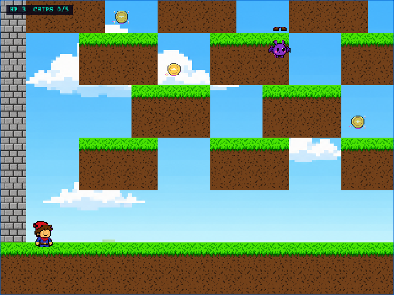
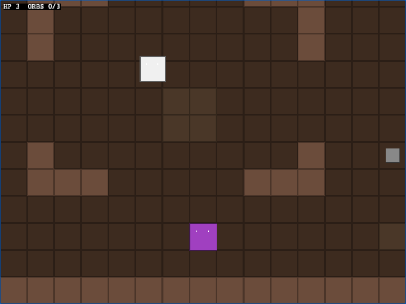

# gameforge

A pluggable skill pack that lets any coding agent (Claude Code, Cursor, Antigravity, Cline, Aider, …) turn a one-line description into a runnable Phaser 3 game.

Eleven cooperating skills — `gameforge` (orchestrator), `game-designer`, `world-architect`, `sprite-artist`, `tile-artist`, `bg-artist`, `codesmith`, `playtester`, `refiner`, `gap-checker`, `level-fixer` — coordinate a deterministic-where-possible / LLM-where-necessary pipeline that produces a Game Design Document, tile-based levels, sprite sheets, tilesets, parallax backgrounds, gameplay code, a headless QA loop with screenshot regression, and a **playability validation pass** that finds and fixes unreachable goals, border holes, and jump-arc gaps.

## Example games

Five games generated and validated by the pipeline (screenshots taken live from headless Chromium):

| Game | Genre | Screenshot |
|------|-------|-----------|
| **Pixel Pete** — A jumpy hero collecting coins through floating platforms | Platformer |  |
| **Neon Runner** — A neon-clad runner collects data chips while avoiding security drones | Platformer |  |
| **Slime Slayer** — A pixel knight collects gems while dodging slimes | Top-down adventure |  |
| **Dungeon Quest** — A wizard battles skeleton guards to collect 3 magic orbs | Dungeon crawler |  |
| **Star Defender** — Fend off falling asteroids from your tiny ship | Shoot-em-up |  |

Image generation is powered by **GPT Image 2** (`gpt-image-2`) — OpenAI's state-of-the-art image generation model — accessible via fal.ai (default provider, requires `FAL_KEY`) or directly through the OpenAI Images API (requires `OPENAI_API_KEY`). Default `quality: low` for prototyping and framework iteration.

## How it works

```
description ─▶ game-designer ─▶ world-architect ─▶ sprite-artist ┐
                                                  tile-artist    ├─▶ codesmith ─▶ playtester ─▶ refiner ─▶ playtester
                                                  bg-artist      ┘                                ▲
                                                                                                   │ (max 3 retries)
                                                                  ┌──────────────────────────────┘
                                                  gap-checker ───▶ level-fixer / refiner (up to 3 fix iterations)
```

- **LLM stages** (`game-designer`, `world-architect`, `codesmith`, `refiner`) are plain SKILL.md instruction docs. The host coding agent supplies the LLM reasoning.
- **Asset stages** (`sprite-artist`, `tile-artist`, `bg-artist`) ship as Node scripts that drive **GPT Image 2** for real pixel-art assets, with deterministic procedural fallbacks. They take JSON in, produce PNGs + manifest entries out.
- **Deterministic stages** (`playtester`) ship as Node scripts under each skill's `scripts/` directory. They take JSON in, produce reports out, never call an LLM.
- **State** lives in a single `game-state.json` at the project root; every stage reads/writes it. Per-asset projections (`public/assets/manifest.json`, `public/data/levels.json`) are derived from state and consumed by the Phaser runtime.

There are no embedded LLM API calls in the SKILL.md files — your coding agent does the reasoning using its own tools. The repository also bundles an optional CLI (`bin/gameforge.mjs`) that calls Claude directly via `@anthropic-ai/sdk`, for non-agent users.

## Install

```bash
git clone https://github.com/Ar9av/gameforge.git ~/gameforge
cd ~/gameforge
npm install

# Symlink skills into your host's skill directory (Claude Code, Cursor, etc.)
mkdir -p ~/.claude/skills
ln -sf ~/gameforge/skills/* ~/.claude/skills/

# (Optional) Install Playwright's Chromium if you don't have system Chrome
npx playwright install chromium
```

## Usage

### Path A — host agent driven (the skill-pack way)

In your coding agent (Claude Code, Cursor, etc.), with the skills symlinked, just say:

> *"Make me a game where a robot navigates a sewer collecting batteries."*

The agent reads `gameforge`'s SKILL.md, follows the pipeline, invokes the sub-skills, runs the deterministic scripts (`init_project.mjs`, `generate_sheets.mjs`, `paint_tiles.mjs`, `run_qa.mjs`, …), and reports success.

### Path B — embedded CLI (no host agent required)

```bash
# Set ANTHROPIC_API_KEY (or put it in ~/.all-skills/.env)
export ANTHROPIC_API_KEY=sk-ant-...

# Set FAL_KEY for image-generation sprites (or use --placeholder-sprites)
export FAL_KEY=...

# Scaffold + generate
gameforge init my-game
cd my-game
gameforge generate "A pixel knight collects gems while dodging slimes"

# Or skip image-gen and use procedural sprites for fast iteration
gameforge generate "..." --placeholder-sprites

# Run it
gameforge dev                    # vite dev server on :5173

# Run the QA harness
gameforge qa
gameforge qa --update-baselines  # refresh after intentional changes

# Refine: feed last QA failures to the refiner agent
gameforge refine
```

Global flags: `--json` (NDJSON on stdout), `--cwd`, `-y/--yes`, `-v/--verbose`. Exit codes: `0` ok, `2` usage, `3` config, `4` network, `5` QA failed, `130` SIGINT.

## Gap Checker — playability validation

`playtester` checks "does it boot and respond to input." `gap-checker` checks "is the game *actually playable*" — three layers running after every generation cycle:

```
static_check.mjs  →  dynamic_check.mjs  →  (VLM visual review)  →  level-fixer / refiner
```

**Static layer** (`skills/gap-checker/scripts/static_check.mjs`): pure JS, no browser. Validates:
- BFS reachability — every pickup/goal tile is connected to the player spawn
- Border integrity — outer ring of the level must be impassable (sides + bottom for platformers; all sides for top-down)
- Jump-arc gaps — platformer gaps wider than 4 tiles (≈ max horizontal jump) are flagged
- Standable spawns — players and enemies must have ground beneath them
- Spawn collision — two entities on the same tile

**Dynamic layer** (`skills/gap-checker/scripts/dynamic_check.mjs`): 30-second smart fuzzer in headless Chromium. Catches stuck states, spawn-traps, out-of-bounds falls, and progress stalls. Saves screenshots at t=0, t=10s, t=20s, t=30s for visual review.

**Gap-check results for the five example games:**

| Game | Static | Dynamic |
|------|--------|---------|
| pixel-pete | ✅ 0 errors, 2 warnings (flying bats — expected) | ✅ boots, player moves |
| neon-runner | ✅ 0 errors, 2 warnings (flying drones — expected) | ✅ boots, player moves |
| slime-slayer | ✅ 0 errors, 0 warnings | ✅ fuzzer collected 1/3 gems |
| dungeon-quest | ✅ 0 errors, 0 warnings | ✅ boots, player moves |
| star-defender | ✅ 0 errors, 0 warnings | ✅ boots, ship moves |

Fixes applied by the gap-checker pipeline on the pixel-pete example:
- Added impassable STONE wall columns on left (x=0) and right (x=21) borders — players could previously walk off the world edge
- Inserted a stepping-stone platform in the middle of an 8-tile sky gap (x=6→14, row 6) — previously unjumpable

Run gap-checker on any generated game:
```bash
# Static only (fast, no browser)
node skills/gap-checker/scripts/static_check.mjs examples/my-game

# Full dynamic + screenshots (requires Playwright)
node skills/gap-checker/scripts/dynamic_check.mjs examples/my-game --port 5199 --seconds 30
```

## Skills

Each skill has a `SKILL.md` (instructions) plus `references/` (schemas, recipes, cookbooks) and/or `scripts/` (deterministic helpers).

| Skill | Role | Image gen? | Scripts |
|---|---|---|---|
| `gameforge` | Orchestrator: drives the pipeline, manages state, handles halt conditions | — | `init_project.mjs`, `validate_state.mjs` |
| `game-designer` | Prompt → GDD JSON | — | `validate_gdd.mjs` |
| `world-architect` | GDD → level layouts | — | `validate_levels.mjs` |
| `sprite-artist` | Entities → sprite sheets + manifest. Real pixel art via **GPT Image 2**; procedural fallback. | yes | `generate_sheets.mjs`, `chroma_key.mjs` |
| `tile-artist` | Palette → tileset PNG. **GPT Image 2** mode for real pixel-art tiles; procedural mode for free flat-color. | yes | `generate_tiles_gpt.mjs`, `paint_tiles.mjs` |
| `bg-artist` | Genre theme → parallax background PNG. **GPT Image 2** for sky/cave/space scenes. | yes | `generate_bg.mjs` |
| `codesmith` | GDD + manifest → `src/scenes/Game.js` | — | `write_files.mjs`, `validate_code.mjs` |
| `playtester` | Headless Playwright + pixelmatch screenshot diff | — | `run_qa.mjs`, `boot_check.mjs` |
| `refiner` | Failures → patched files | — | `collect_files.mjs`, `apply_fixes.mjs` |
| `gap-checker` | Playability validation: static BFS + dynamic Playwright fuzzer + VLM visual review | — | `static_check.mjs`, `dynamic_check.mjs` |
| `level-fixer` | Gap-checker issues → patched `levels.json` | — | — |

## Validated genres

| Genre | Example | Mechanics tested | Gap-check |
|---|---|---|---|
| Platformer | pixel-pete, neon-runner | Gravity, JustDown jump, blocked-down detection, wall-border containment | ✅ static + dynamic |
| Top-down adventure | slime-slayer, dungeon-quest | 4-direction, attack hitbox, pickups, HP, BFS reachability | ✅ static + dynamic |
| Shoot-em-up | star-defender | Projectiles, timed enemy spawn, kill-count win | ✅ static + dynamic |

All five examples pass at 60 fps with zero console errors on a fresh clone.

## Project layout (this repo)

```
gameforge/
├── README.md
├── package.json                # framework deps (sdk, playwright, sharp, …)
├── bin/gameforge.mjs           # optional CLI shebang
├── src/                        # CLI implementation + shared lib
│   ├── cli.js
│   ├── commands/               # init, generate, qa, refine, dev, build
│   ├── agents/                 # LLM call sites (used only by Path B)
│   ├── lib/                    # state, sprites, server, anthropic, log, errors, template
│   └── qa/                     # harness, scenarios, runner
├── skills/                     # the skill pack (Path A)
│   ├── gameforge/{SKILL.md, references/, scripts/}
│   ├── game-designer/...
│   ├── world-architect/...
│   ├── sprite-artist/...
│   ├── tile-artist/...
│   ├── codesmith/...
│   ├── playtester/...
│   └── refiner/...
├── templates/phaser-game/      # per-game starter (Phaser 3 + Vite + ESM)
├── examples/                   # generated sample games
├── test/                       # smoke + fixture-based E2E
└── docs/
    ├── architecture.md
    └── coding-agent-integration.md
```

## Project layout (per generated game)

```
my-game/
├── game-state.json             # shared state — single source of truth
├── package.json                # phaser + vite
├── vite.config.mjs
├── index.html
├── public/
│   ├── assets/
│   │   ├── entities.png        # sprite-artist output (GPT Image 2 or procedural)
│   │   ├── tiles.png           # tile-artist output
│   │   ├── bg.png              # bg-artist output (optional, parallax)
│   │   └── manifest.json       # row/col labels + cell size + bg metadata
│   └── data/
│       └── levels.json         # world-architect output
├── src/
│   ├── main.js                 # Phaser bootstrap (template, never edit)
│   ├── config.js               # game config: pixelArt, FIT, RND seed
│   └── scenes/
│       ├── Boot.js             # template, never edit
│       ├── Preload.js          # builds anims from manifest, never edit
│       └── Game.js             # codesmith-written
└── qa/
    ├── __baselines__/<scenario>.png
    ├── __actual__/<scenario>.png       (gitignored)
    ├── __diffs__/<scenario>.png        (gitignored)
    └── qa-report.json
```

## Optional integrations

- **`FAL_KEY`** (preferred) — provider for **GPT Image 2** (`gpt-image-2`) at `https://fal.run/openai/gpt-image-2`. Default for sprite/tile/bg generation. Cheapest path: `quality: low` + fal.ai.
- **`OPENAI_API_KEY`** — direct alternative provider for **GPT Image 2** at `https://api.openai.com/v1/images/generations`. Same model, different request shape; the asset skills auto-detect and switch.
- **`~/.all-skills/sprite-sheet/`** — battle-tested external skill that wraps the fal.ai endpoint. Used by `sprite-artist` when present; the bundled scripts also call GPT Image 2 directly without it.
- **`ANTHROPIC_API_KEY`** — required for the embedded CLI's `generate` and `refine` commands. Path A doesn't need it (host agent supplies the model).
- **System Chrome** — used by Playwright via `channel: 'chrome'` to skip the 170MB Chromium download. Falls back to bundled if unavailable.

## Credits

The multi-agent pipeline structure (specification → planning → architecture → implementation → integration → testing/refinement, with feedback loops) is inspired by the **OpenGame** paper, *OpenGame: Open Agentic Coding for Games* — https://arxiv.org/abs/2604.18394.

The skill-pack structure is patterned after [PaperOrchestra](https://github.com/Ar9av/PaperOrchestra) (the inverse of "embed an LLM in your tool"; instead, ship instructions + deterministic helpers and let the host agent do the LLM work).

Built on Phaser 3 (https://phaser.io), Playwright, pixelmatch, sharp, commander, @clack/prompts, consola, and the Anthropic SDK.

## License

MIT
