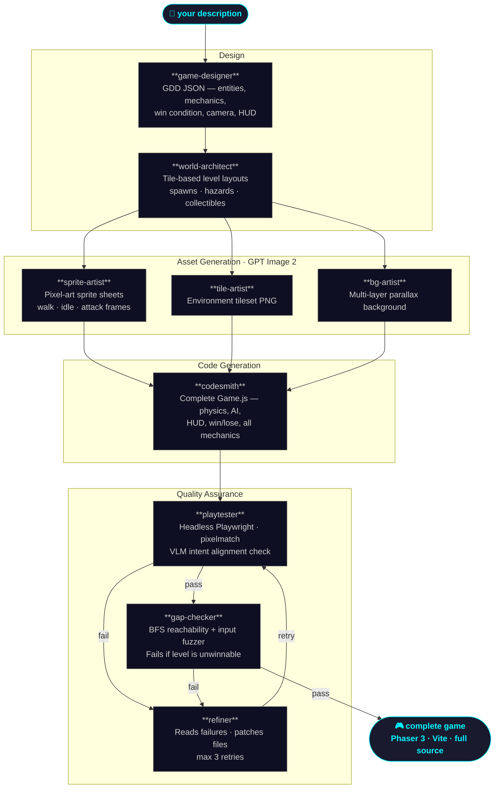

# game-creation-agent

**The AI-native game engine.** Describe your game in one sentence — get back a complete, playable title with real pixel-art sprites, hand-crafted levels, production game code, automated QA, and optional real-time multiplayer.

No Unity license. No art budget. No boilerplate. Just a description.

## Games built with it

Six complete games, generated end-to-end. Screenshots captured live from headless Chromium:

| Game | Genre | Screenshot |
|------|-------|-----------|
| **Dungeon Knight** — Armored knight scales a spike-filled dungeon slashing skeletons and collecting golden orbs | Action-platformer |  |
| **Dragon Brawl** — Street fighter battles through waves of gang members in gritty urban alleys | Beat-em-up |  |
| **Island Quest** — Young hero explores a magical island collecting heart crystals to restore the sacred shrine | Top-down adventure |  |
| **Sewer Bot** — Scrappy maintenance robot navigates toxic sewers collecting power cells while battling mechanical vermin | Action-platformer (NES) |  |
| **Pixel Town** — Trainer explores a Pokémon-inspired village, talking to locals and finding five hidden treasure chests | Top-down RPG |  |
| **Nova Blitz** — Pilot a neon cyan starfighter through waves of massive alien ships, build combos and drop screen-clearing nova bombs | Neon shoot-em-up |  |

Each ships with full source, GPT Image 2 sprite sheets, level data, and `game-state.json`. Play any of them immediately:

```bash
cd examples/nova-blitz   # or dungeon-knight / dragon-brawl / island-quest / sewer-bot / pixel-town
npm install
npm run dev              # opens http://127.0.0.1:5173
```

## Engine architecture

The engine is a fully automated pipeline. Each stage is a specialized system — some powered by LLMs, some by image generation, some deterministic scripts. State flows through `game-state.json` at every step.



| System | What it does |
|--------|-------------|
| **game-designer** | Turns your description into a full Game Design Document (GDD) — entities, mechanics, win condition, camera, HUD |
| **world-architect** | GDD → tile-based level layouts with spawn points, hazards, and collectibles |
| **sprite-artist** | Every entity → a GPT Image 2 pixel-art sprite sheet (walk/idle/attack frames). Procedural fallback if no API key. |
| **tile-artist** | Environment palette → GPT Image 2 tileset PNG |
| **bg-artist** | Genre + mood → multi-layer parallax background PNG |
| **audio-composer** | Genre → SFX + music loop. ElevenLabs MP3s when `ELEVENLABS_API_KEY` is set; chiptune oscillators otherwise. Writes `AudioManager.js`. |
| **palette-enforcer** | Quantizes all generated PNGs to a named 8-bit palette (PICO-8, Sweetie-16, Endesga-32, Game Boy, NES). Runs after art, before codesmith. |
| **codesmith** | GDD + asset manifest → complete `src/scenes/Game.js` with physics, AI, HUD, win/lose flow |
| **manifest-auditor** | Statically cross-references every animation/texture key in `Game.js` against `manifest.json`. Catches silent Phaser failures before a browser opens. |
| **mobile-compat-checker** | 5-item mobile lint: `roundPixels`, `image-rendering: pixelated` CSS, `devicePixelRatio`, touch input, AudioContext unlock. Auto-patches first two. |
| **parallel-qa-orchestra** | Runs 4 QA workers concurrently (static analysis, golden-path, fuzzer, physics-debug). Replaces serial playtester→gap-checker. ~30s vs ~2 min. |
| **physics-debug-validator** | Boots game with Phaser arcade debug enabled, screenshots all physics bodies, emits hitbox alignment report. Catches invisible collision bugs. |
| **gap-checker** | Playability validation: static BFS reachability + dynamic input fuzzer. Fails build if level is unwinnable. |
| **refiner** | Reads playtester/gap-checker failures, patches the broken file, hands back to playtester (max 3 retries) |
| **multiplayer** | Generates a Colyseus WebSocket server + patches Game.js for real-time sync. Optional. |

The engine runs inside any LLM coding agent (Claude Code, Cursor, etc.) that can read SKILL.md files — no separate API key required beyond what your agent already uses.

## Supported genres

The engine ships with battle-tested implementations for six genres, each with genre-specific mechanics baked in:

| Genre | Reference game | Engine mechanics |
|-------|---------------|-----------------|
| Action-platformer | dungeon-knight, sewer-bot | Gravity, coyote-time jump, variable jump height, melee / projectile attack, spike/acid hazard tiles, multi-phase boss fight |
| Beat-em-up | dragon-brawl | Pseudo-3D Y-depth movement, y-sort rendering, one-way camera scroll, enemy wave spawner, combo hit system |
| Top-down adventure | island-quest | 8-direction normalized movement, weapon knockback, enemy chase/wander AI, tilemap collision layers |
| Top-down RPG | pixel-town | 4-direction movement, NPC dialogue system, wander AI, chest pickups, y-sort depth |
| Neon shoot-em-up | nova-blitz | Auto-fire, wave spawner, V-formation + bomber AI, combo multiplier, nova bomb, procedural starfield, screen shake |

New genres can be added by writing a new codesmith template — the rest of the pipeline is genre-agnostic.

## Quick start

```bash
git clone https://github.com/Ar9av/gameforge.git ~/game-creation-agent
cd ~/game-creation-agent
npm install

# Symlink engine skills into your coding agent's skill directory
mkdir -p ~/.claude/skills
ln -sf ~/game-creation-agent/skills/* ~/.claude/skills/

# (Optional) Playwright Chromium for QA screenshots and GIF recording
npx playwright install chromium
```

Then, in Claude Code (or any agent with the skills loaded):

> *"Make me a game where a robot navigates a sewer collecting batteries."*

The engine reads the orchestrator, runs every stage in sequence, self-corrects up to three times, and reports a working game with a live screenshot.

### Regenerate example assets

Requires only `FAL_KEY` for GPT Image 2. No LLM API key needed:

```bash
export FAL_KEY=your_fal_key_here

node scripts/gen_game.mjs dungeon-knight
node scripts/gen_game.mjs dragon-brawl
node scripts/gen_game.mjs island-quest
node scripts/gen_game.mjs sewer-bot
node scripts/gen_game.mjs pixel-town
node scripts/gen_game.mjs nova-blitz
```

Change `'low'` to `'medium'` or `'high'` in the script for higher-quality sprites.

## Audio

Every generated game gets a two-tier audio system — no extra setup required.

### Tier 1 — Chiptune oscillators (free, zero dependencies)

The default. Genre-appropriate SFX descriptors and a pentatonic music loop are written to `sfx.json` and `music.json`. All sound is synthesised at runtime by `AudioManager.js` using Web Audio `OscillatorNode` — no audio files, works offline.

### Tier 2 — ElevenLabs AI sound effects (optional upgrade)

Set `ELEVENLABS_API_KEY` before running `audio-composer` and it calls the [ElevenLabs text-to-sound-effects API](https://elevenlabs.io/docs/api-reference/text-to-sound-effects/convert) to generate a real MP3 for every SFX action. Each sound uses a genre-flavoured text prompt (e.g. `"2D action platformer game, retro 8-bit jump sound, quick upward pitch sweep"`).

MP3s land in `public/assets/sfx/` and are referenced in `sfx.json` as `mp3Path`. `AudioManager.js` preloads them as `AudioBuffer`s on first user interaction (Safari-safe) and plays the MP3 when available, silently falling back to the oscillator if a file fails to load.

```bash
export ELEVENLABS_API_KEY=your_key_here
node skills/audio-composer/scripts/compose_audio.mjs <project-dir>

# Force oscillator mode even if key is set:
node skills/audio-composer/scripts/compose_audio.mjs <project-dir> --no-elevenlabs
```

`AudioManager.play('jump')` works identically in both tiers — no Game.js changes needed when switching modes.

## Multiplayer

Any generated game can be upgraded to real-time multiplayer:

```bash
node skills/multiplayer/scripts/init_server.mjs <project-dir>   # Colyseus WebSocket server
node skills/multiplayer/scripts/patch_game.mjs <project-dir>    # patches Game.js for network sync

# Extras:
node skills/multiplayer/scripts/init_server.mjs <project-dir> --voice   # PeerJS voice/video
node skills/multiplayer/scripts/init_server.mjs <project-dir> --lobby   # React lobby frontend
```

Up to 4 players, 20 Hz tick rate, TypeScript shared schemas. See [`skills/multiplayer/SKILL.md`](skills/multiplayer/SKILL.md).

## Engine layout

```
game-creation-agent/
├── README.md
├── package.json
├── scripts/
│   ├── gen_game.mjs          # generate any example game (GPT Image 2 + inline GDD)
│   ├── record_gif.mjs        # record gameplay GIF via headless Chromium
│   ├── debug_library.mjs     # persistent cross-run bug/fix knowledge base
│   └── intent_qa.mjs         # VLM screenshot scoring against original prompt
├── src/                      # shared engine libs (sprite loading, state, utils)
├── skills/                        # engine pipeline — one SKILL.md per stage
│   ├── gameforge/                 # orchestrator: drives the full pipeline
│   ├── game-designer/             # prompt → GDD JSON
│   ├── world-architect/           # GDD → level layouts
│   ├── sprite-artist/             # entities → GPT Image 2 sprite sheets
│   ├── tile-artist/               # palette → GPT Image 2 tileset
│   ├── bg-artist/                 # theme → parallax background
│   ├── audio-composer/            # genre → SFX + music (ElevenLabs or oscillator)
│   ├── palette-enforcer/          # PNG → named 8-bit palette quantization
│   ├── codesmith/                 # GDD + manifest → Game.js
│   ├── manifest-auditor/          # static anim/texture key cross-reference
│   ├── mobile-compat-checker/     # 5-item mobile lint + auto-patch
│   ├── parallel-qa-orchestra/     # 4 concurrent QA workers, merged report
│   ├── physics-debug-validator/   # hitbox alignment via Phaser debug mode
│   ├── playtester/                # headless Playwright QA + VLM intent check
│   ├── refiner/                   # failures → patches → retry
│   ├── gap-checker/               # BFS reachability + dynamic fuzzer
│   └── multiplayer/               # Colyseus + PeerJS + React lobby (optional)
├── templates/phaser-game/    # per-game Phaser 3 + Vite starter
└── examples/
    ├── dungeon-knight/       # action-platformer: coyote-time, boss fight
    ├── dragon-brawl/         # beat-em-up: pseudo-3D, wave spawner
    ├── island-quest/         # top-down adventure: 8-dir movement
    ├── sewer-bot/            # NES-style platformer: arm cannon, boss spread
    ├── pixel-town/           # top-down RPG: NPC dialogue, y-sort
    ├── nova-blitz/           # shoot-em-up: wave AI, combos, nova bomb
    └── screenshots/          # live headless-Chromium captures
```

## API keys

| Key | Used for | Required? |
|-----|----------|-----------|
| `FAL_KEY` | GPT Image 2 sprites, tiles, backgrounds via fal.ai | For art generation |
| `OPENAI_API_KEY` | Direct OpenAI alternative for GPT Image 2 | Auto-detected if FAL_KEY absent |
| `ANTHROPIC_API_KEY` | VLM intent QA, NPC dialogue generation | Optional quality features |
| `ELEVENLABS_API_KEY` | AI-generated MP3 sound effects via ElevenLabs text-to-sound API | Optional — chiptune fallback used if absent |

## Credits

Inspired by the **OpenGame** paper (*OpenGame: Open Agentic Coding for Games* — https://arxiv.org/abs/2604.18394) and the skill-pack pattern from [PaperOrchestra](https://github.com/Ar9av/PaperOrchestra).

Built on Phaser 3, Playwright, sharp, and fal.ai.

## License

MIT
