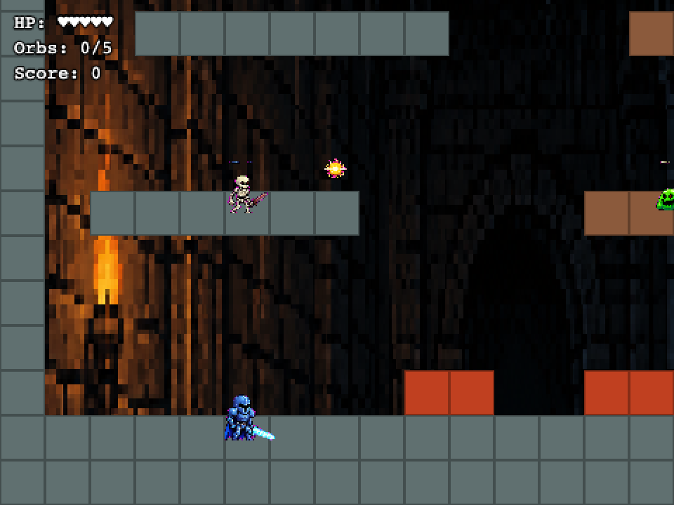
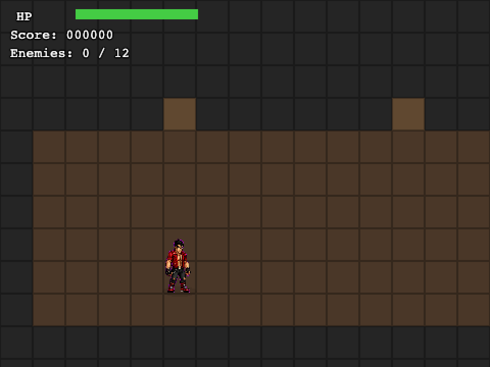
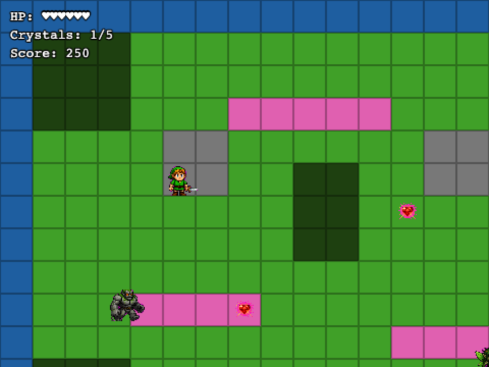
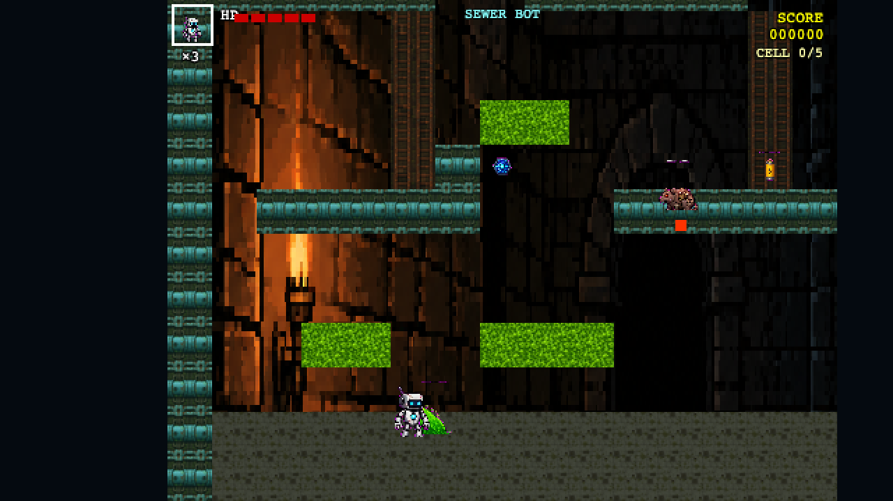
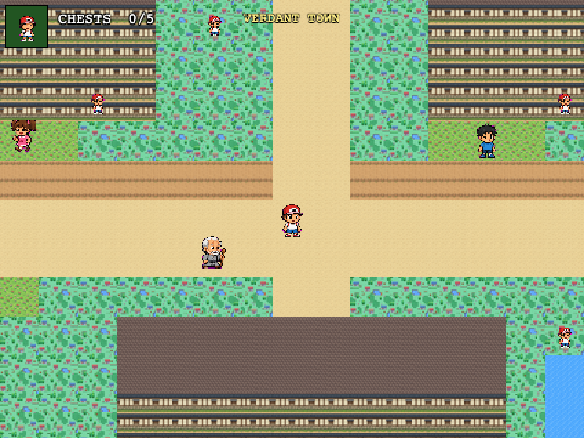

# Example games

Six complete Phaser 3 games built with **gamewright** using real GPT Image 2 sprites and backgrounds. Each ships with full source, sprite sheets, level data, and `game-state.json` — run `npm install && npm run dev` to play immediately.

| Folder | Genre | Win condition | Controls |
|---|---|---|---|
| `dungeon-knight/` | Action-platformer | Collect 5 orbs | Arrows + Space (jump) + Z (slash) |
| `dragon-brawl/` | Beat-em-up | Defeat 12 enemies | WASD/arrows + Space (punch) |
| `island-quest/` | Top-down adventure | Collect 5 heart crystals | WASD/arrows + Space (sword) |
| `sewer-bot/` | Action-platformer | Collect 5 batteries | Arrows + Space (jump) + Z (shoot) |
| `pixel-town/` | Top-down RPG | Find all 5 treasure chests | WASD/arrows + Space (talk) |
| `nova-blitz/` | Neon shoot-em-up | Destroy 30 enemies | WASD/arrows + Z (fire) + X (bomb) |

---

## Dungeon Knight

*Armored knight scales a spike-filled dungeon slashing skeletons and collecting golden orbs to unlock the exit.*



- **Genre**: Action-platformer (Shovel Knight style)
- **Sprites**: GPT Image 2 — knight, skeleton, slime, ghost, orb, dark knight boss
- **Background**: GPT Image 2 dungeon parallax
- **Mechanics**: Coyote-time jump, variable jump height, Z-key sword slash, spike tiles, dark knight boss

---

## Dragon Brawl

*Street fighter battles through waves of gang members in gritty urban alleys.*



- **Genre**: Beat-em-up (Double Dragon style)
- **Sprites**: GPT Image 2 — fighter, thug, enforcer, biker, dragon boss
- **Background**: GPT Image 2 city-night street
- **Mechanics**: Pseudo-3D Y-depth movement, one-way camera scroll, enemy wave spawner every 2.2 s, y-sort depth, HP bar HUD

---

## Island Quest

*Young hero explores a magical island collecting heart crystals to restore the sacred shrine.*



- **Genre**: Top-down adventure (Link's Awakening style)
- **Sprites**: GPT Image 2 — hero, villager, forest sprite, stone golem, dark wizard boss, heart crystal
- **Mechanics**: 8-direction movement, sword attack with knockback, enemy chase/wander AI, water + tree collision, wizard boss

---

## Sewer Bot

*A scrappy maintenance robot navigates toxic sewers collecting power cells while battling mechanical vermin.*



- **Genre**: Action-platformer (NES quality)
- **Sprites**: GPT Image 2 — VOLT_BOT, rat drone, sludge blob, pipe spider, battery, shield pack, mainframe boss
- **Background**: GPT Image 2 dungeon/sewer parallax
- **Mechanics**: Coyote-time jump, Z-key shoot (bullet pool, max 3), ACID tile hazard, SHIELD_PACK armor pickup, CORE_MAINFRAME boss with 3→5-way bullet spread, NES-style segmented HP bar with portrait box and lives counter

---

## Nova Blitz

*Pilot a neon cyan starfighter through escalating waves of massive alien ships. Hold Z to auto-fire, X drops a screen-clearing nova bomb, build combo chains for bonus score.*


- **Genre**: Neon shoot-em-up (Galaga / DoDonPachi style)
- **Sprites**: GPT Image 2 — SHIP, FIGHTER, BOMBER, BULLET, GEM
- **Tiles**: GPT Image 2 — void, nebula, starfield
- **Background**: GPT Image 2 deep space parallax
- **Mechanics**: Procedural 3-layer scrolling starfield, V-formation enemy waves, sinusoidal dive AI, bomber homing shots, nova bomb, combo multiplier, engine glow trail, segmented shield HUD, full screen flash + camera shake on kills

---

## Pixel Town

*A trainer explores Verdant Town — a Pokémon-inspired village — talking to locals and hunting five hidden treasure chests scattered across the map.*



- **Genre**: Top-down RPG (Pokémon Gold/Ruby style)
- **Sprites**: GPT Image 2 — TRAINER, NPC_GIRL, NPC_BOY, NPC_ELDER, CHEST
- **Tiles**: GPT Image 2 — grass, dirt path, trees, flowers, house walls, roofs, fences, water
- **Mechanics**: 4-direction movement (no diagonal), NPC dialogue system (SPACE to talk/dismiss), wandering NPC AI, chest sparkle pickup, y-sort depth, HUD portrait + chest counter

---

## Run any example

```bash
cd examples/dungeon-knight   # or dragon-brawl / island-quest / sewer-bot / pixel-town
npm install
npm run dev                  # opens http://127.0.0.1:5173
```

## Regenerate assets

Assets were generated without an LLM API key using `scripts/gen_game.mjs` — the GDD and level design are authored inline, and only GPT Image 2 (via `FAL_KEY`) is called for sprites and backgrounds:

```bash
node --env-file=~/.all-skills/.env scripts/gen_game.mjs dungeon-knight
node --env-file=~/.all-skills/.env scripts/gen_game.mjs dragon-brawl
node --env-file=~/.all-skills/.env scripts/gen_game.mjs island-quest
node --env-file=~/.all-skills/.env scripts/gen_game.mjs sewer-bot
node --env-file=~/.all-skills/.env scripts/gen_game.mjs pixel-town
```

Requires `FAL_KEY` in `~/.all-skills/.env`. Change `'low'` to `'medium'` or `'high'` in the script for higher-quality sprites.
